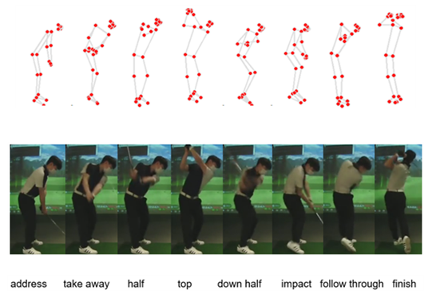
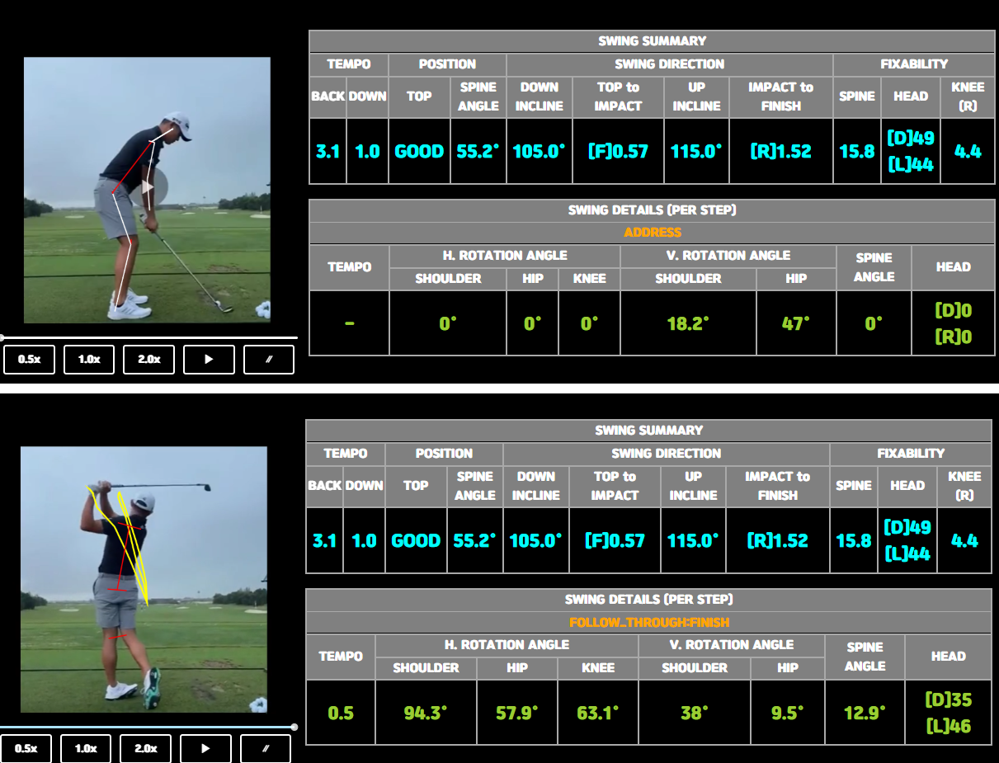

# 골프 스윙 분석 서비스 (Golf Swing Analysis Service)
## http://km.tempodiall.com/
---

## 📌 소개
이 프로젝트는 **Mediapipe**를 기반으로 골프 스윙의 주요 동작 단계를 자동으로 분석하고, 각 단계별 키포인트 데이터를 추출하는 FastAPI 기반 백엔드 서비스입니다.
이후 분석은 키포인트 데이터 기반으로 분석을 하며, 이는 private로써 공개가 불가능합니다.  
`address`, `take_away`, `half`, `top`, `down_half`, `impact`, `follow_through`, `finish` 등의 주요 단계와 좌표 데이터를 확인할 수 있습니다.

---

## 🛠️ 주요 기능

1. **비디오 업로드 및 분석**:
   - 클라이언트가 제공한 S3 경로의 비디오를 다운로드하여 분석.
   - 해당 분석 방법은 공개하지 않습니다.
   - 

2. **Mediapipe 기반 자세 추정**:
   - `Pose` 모델(단순 및 고도화 모델)을 활용하여 골프 스윙 자세를 추정.
   - 스윙 단계(address ~ finish) 별 키포인트 데이터를 추출.
   - 전-후처리를 통해 성능향상
   - 

3. **백그라운드 작업 처리**:
   - 비디오 분석 작업은 `BackgroundTasks`로 비동기 처리.
   - `asyncio.Event`를 활용해 작업 완료 상태를 관리.

4. **API 엔드포인트**:
   - `/pose`: 비디오 업로드 및 스윙 분석 요청.

5. **Test**
   - locust를 통해 스트레스 테스트 진행.
   - local test를 원할 경우 테스트용 라우터에 요청.

---

## 🚀 사용법

### 1. 서버 실행
- `main.py` 파일을 실행하여 서버를 시작합니다:
```bash
  $ python main.py
```

### 2. API 요청

#### `/pose` 엔드포인트
- **설명**: 비디오를 업로드하여 자세 분석을 시작합니다.
- **HTTP 메서드**: `POST`
- **요청 예시**:
  ```json
  {
      "url": "username/videoname.mp4",
      "handType": "R"
  }
  ```

## 🛠️ 설정 파일

### 1. `config.yaml`
- S3 설정:
  ```yaml
  S3:
    s3_accesskey: "YOUR_ACCESS_KEY"
    s3_privatekey: "YOUR_PRIVATE_KEY"
    s3_region_name: "YOUR_REGION"
    s3_bucket_name: "YOUR_BUCKET_NAME"
  ```

### 2. `keypoints.yaml`
- 분석에 필요한 키포인트 정보:
  ```yaml
  key_point_string: ["joint_1", "joint_2", ...]
  string_match_index: [0, 1, ...]
  eight_step: ["address", "take_away", "half", ...]
  ```

---

## 📂 프로젝트 구조

```
📦 프로젝트 루트
├── main.py              # FastAPI 메인 파일
├── routers/             # API 라우터
├── utils/               # 유틸리티 함수
├── config.yaml          # 설정 파일
├── keypoints.yaml       # 키포인트 정보
└── README.md            # README 파일
```

---

## 📜 라이선스

이 프로젝트는 [Apache 2.0 License](https://www.apache.org/licenses/LICENSE-2.0)를 따릅니다.

```
Copyright 2025 [Your Name or Organization]

Licensed under the Apache License, Version 2.0 (the "License");
you may not use this file except in compliance with the License.
You may obtain a copy of the License at

    http://www.apache.org/licenses/LICENSE-2.0

Unless required by applicable law or agreed to in writing, software
distributed under the License is distributed on an "AS IS" BASIS,
WITHOUT WARRANTIES OR CONDITIONS OF ANY KIND, either express or implied.
See the License for the specific language governing permissions and
limitations under the License.
```
